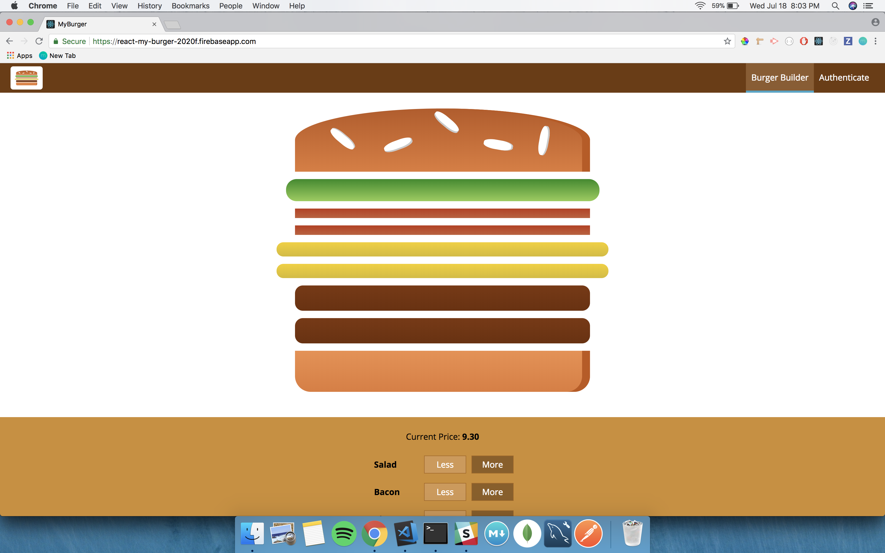

# React My Burger

An application which allows customers to create and order burgers. The project uses ReactJS on the front-end with a Friebase backend. Using Reacted allowed for great performance including being a single page app, and allowing for lazy loading. Through Firebase's REST API one is able to create their own account and session as well as have access to their order history.

## [Deployed Here](https://react-my-burger-2020f.firebaseapp.com/)



## Getting Started

### Prerequisites

Installing Create-React-Native-App and the latest versions of NPM and Node.

```
$ npm i -g create-react-native-app@latest
$ npm i -g node@latest
$ npm i -g npm@latest
```

### Installing

After cloning the repo, cd into the directory and install the required npm packages:


```
npm i
```

## Running the tests
To test the application using **jest** & **enzyme** run the following command

```
npm run test
```

## Deployment

```
npm run build
```

## Built With

* [ReactJS](https://reactjs.org/) - The web framework used
* [React Router](https://www.npmjs.com/package/react-router-dom) - Router allowing for single page applications
* [Redux](https://redux.js.org/) - Used for state management
* [Redux Thunk] (https://github.com/reduxjs/redux-thunk) - Used for asynchronous state management
* [Axios] (https://www.npmjs.com/package/axios) - Used for HTTP Requests
* [Firebase] (https://firebase.google.com/) - Used for the backend of the website and deployment
* [Redux Saga] (https://redux-saga.js.org/) - Used as an alternative to Redux Thunk
* [Jest] (https://jestjs.io/) - Used for testing in conjunction with Enzyme
* [Enzyme](http://airbnb.io/enzyme/) - Used for testing in conjunstion with Jest

## Authors

* **Sam G Zun** - [SZun](https://github.com/SZun)

See also the list of [contributors](https://github.com/your/project/contributors) who participated in this project.